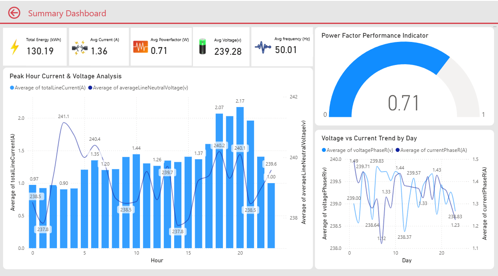
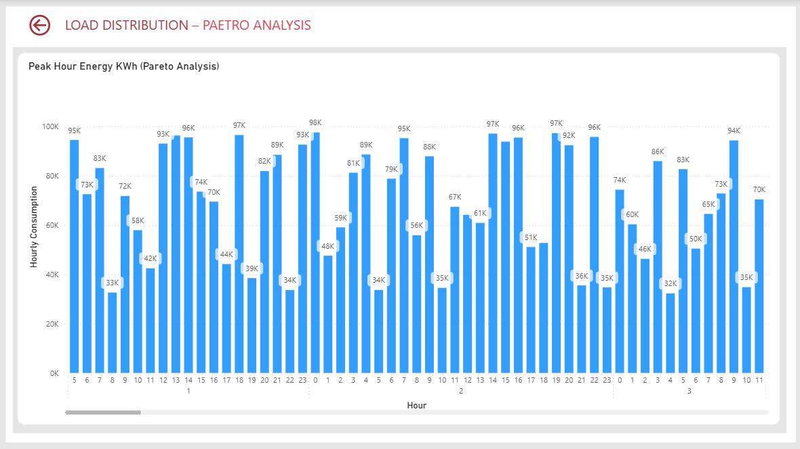
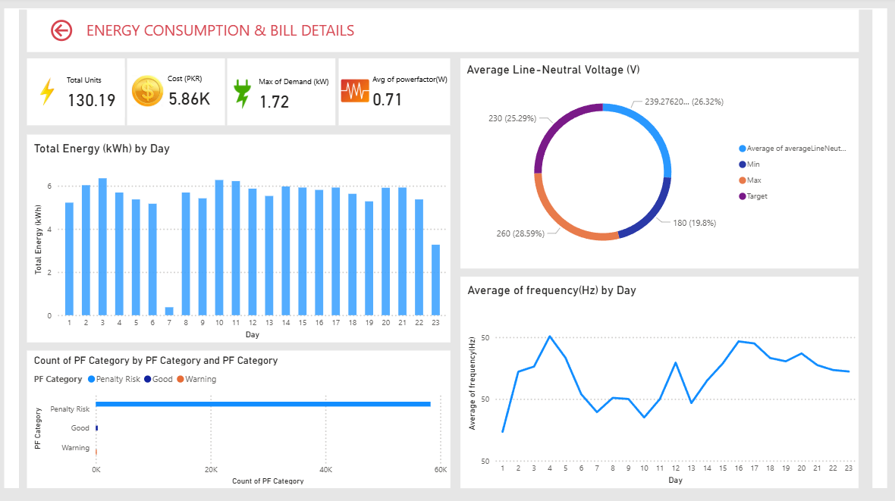
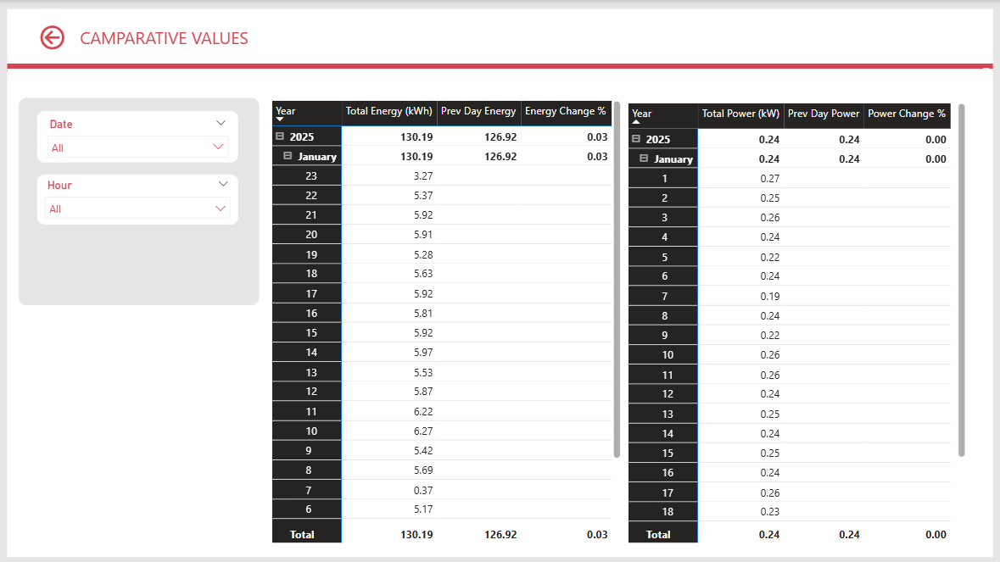

# Instrux-Electricity-Sensor-Data-Analytics-Dashboard
Raw sensor-based electricity data lacked structured insights for monitoring usage patterns and anomalies.  Designed and developed an interactive Power BI dashboard to analyze electricity consumption trends,  detect irregular patterns, and support data-driven energy optimization decisions.

# ⚡ Instrux Electricity Data Analysis Dashboard - Power BI

Interactive electricity monitoring dashboard built in Power BI to analyze voltage, current, power consumption, energy trends, and system efficiency using real-time sensor data.

This project is an end-to-end Electricity Data Analytics Dashboard developed using **Python (Pandas)** and **Power BI**. The dataset contains **58,809 time-series records** collected from an Instrux electricity monitoring system between **January 1, 2025 and January 23, 2025**.

The raw dataset originally contained **346 columns**, which were cleaned and reduced to **13 meaningful features** using Python. Data preprocessing steps included removing empty and constant columns, converting datetime fields, structuring time-series data, and exporting the cleaned dataset for visualization in Power BI.

The Power BI dashboard provides interactive insights into:

- Voltage stability monitoring  
- Current variation analysis  
- Real power and total energy trends  
- Power factor efficiency analysis  
- Frequency stability monitoring  
- Peak load identification  

Key Power BI concepts used in this project include **DAX measures**, **time-series analysis**, **KPI cards**, **line charts**, **slicers**, and **data modeling**.

This dashboard helps monitor electrical system stability, detect irregular behavior, and analyze consumption patterns for better energy management and data-driven decision-making.

---

## Dashboard Preview

